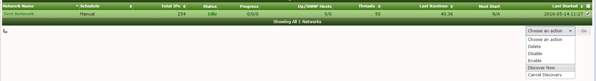

Adding your first devices
=========================================================

This section describes how to scan your first network and adding the devices to RedvsGreen.

.. Tip:: Before proceding it can be good to standardize on a common snmp standard for all devices. Example SNMP V3.

Cacti Automation Network Scanning
------------

Login in to RedvsGreen via the Webgui and Click on the Cacti button.

First we need to setup the default snmp credentials for your network.

    Go to: Console -> Automation -> SNMP Options
    
Open the default option set and add all your SNMP credentials.

After you filled out all of your credentials:

    Go to: Console -> Automation -> Networks
    
Open "Test Network" and change it to reflect the network you will scan. After you changed it hit the save button and go back to the previous page. Here you can select "Test network" and manually issue a "Discover Now" event.

.. Tip:: You can reuse the "Test Network" for other scans, or you can create your own network and have them continuously scanned for automatic device addition.

.. Note:: All devices needs to be reachable by ICMP ping and SNMP(UDP 161)

Troubleshooting
------------

Network Scanning
~~~~~~~~~~~~~~~~~~~~

Common resons for device not being found:

1. Does not respond to ICMP:

Issue a ping from CLI to the device:

    `ping 192.168.206.5`
    
    Success:

.. code-block:: rst
PING 192.168.206.5 (192.168.206.5) 56(84) bytes of data. 
64 bytes from 192.168.206.5: icmp_seq=1 ttl=64 time=0.537 ms  
64 bytes from 192.168.206.5: icmp_seq=2 ttl=64 time=0.654 ms
--- 192.168.206.5 ping statistics ---
2 packets transmitted, 2 received, 0% packet loss, time 1000ms
rtt min/avg/max/mdev = 0.537/0.595/0.654/0.063 ms

2. Does not respond to snmp:

Issue a snmpwalk from CLI to the device:

    `snmpwalk -v2c -c public 192.168.206.5`
    
    Success shows lots of SNMP-MIB information:
    
    ...
    SNMPv2-MIB::sysDescr.0 = STRING: Linux ntp.lab 3.10.0-327.4.4.el7.x86_64 #1 SMP Tue Jan 5 16:07:00 UTC 2016 x86_64
    SNMPv2-MIB::sysObjectID.0 = OID: NET-SNMP-MIB::netSnmpAgentOIDs.10
    ...

3. Device is not automatically detected in RedvsGreen

    Not all vendors have been added. Look for currently supported Vendors in the introduction section.
    Note that you can still add them manually and import templates that are not supported out of the box.
    
    

