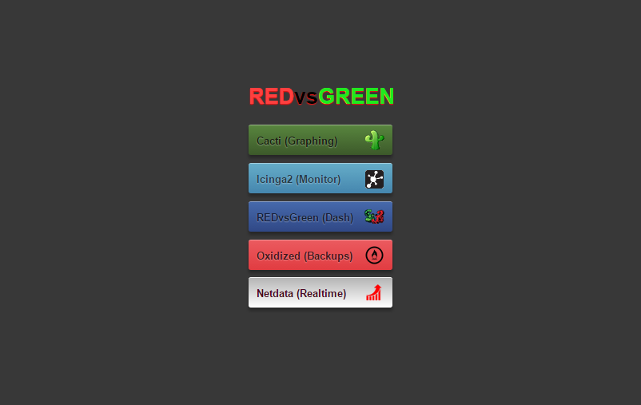
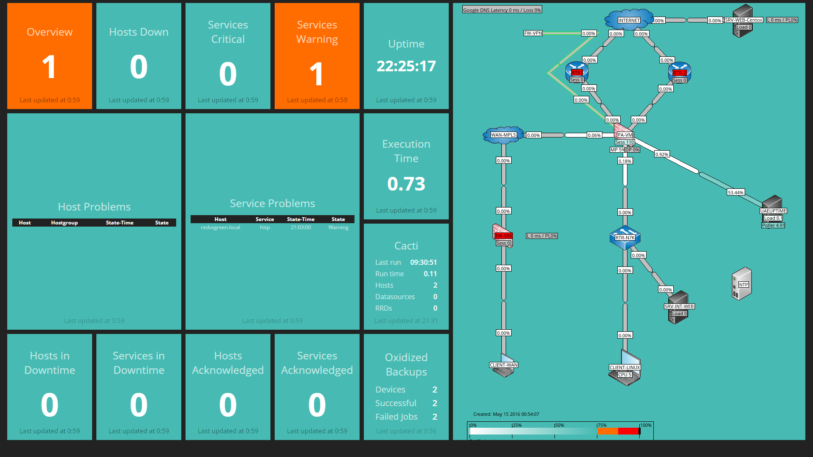

Introduction
============

What is RedvsGreen
----------

RedvsGreen is a VM with a collection of open source monitoring solutions as well as templates and default monitoring plugins for common vendors. 
The inspiration for creating this came from the amazing CactiEZ.

It consists of:

.. code-block:: rst

* Cacti v1.0.0 + Weathermap
* Icinga v2.4.7 + Web2 + Director
* Oxidized v14.0.1
* Netdata
* Dashinga2(icinga2-dashing with some modifications)

Its running on Centos 7 Kernel 3.10 with:

.. code-block:: rst

* SSL enabled on everything
* KSM memory deduping enabled
* Latest updates

The goal with RedvsGreen is to provide a complete network/data center monitoring tool that is fast and easy to configure.

Supported Vendors
----------

.. code-block:: rst

* Juniper - EX/SRX/Netscreen
* PulseSecure - MAG
* Palo ALto - VM/Appliance
* Bluecoat - ProxySG
* F5 - LTM/APM

Screenshots
--------

Feedback
--------

info@redvsgreen.com
